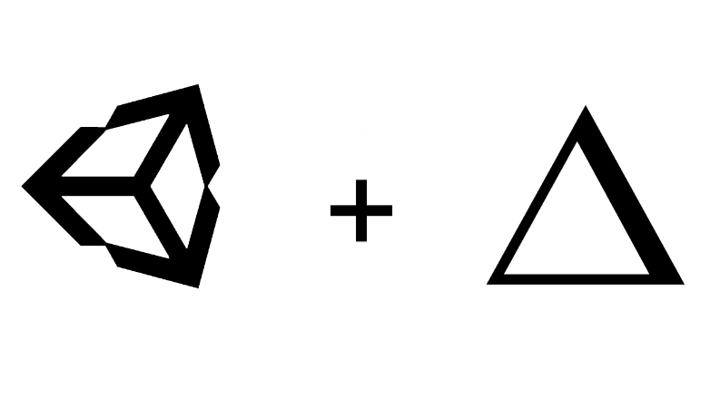

 
<strong>Unity Now</strong> 
<h4>Deploy Unity WebGL builds on Zeit Now serverless platform with ease.</h4>

## Installation
0. Download the latest .unitypackage from [Releases](https://github.com/skibitsky/unity-now/releases)
1. Import it into your Unity Project
2. Add your [access token](https://zeit.co/account/tokens) to the **Configure Now** assets (Assets/unity-now/ConfigureNow)
3. Run Now→ Deploy from the menu bar
	 
4. Select your WebGL build
5. Wait till deployment completes

## Configuration
You can configure Unity Now using **Configure Now** scriptable object. It is located at *Assets/unity-now/ConfigureNow* and contains the following properties:

| Name | Description |
| --- | --- |
| **Token** | Zeit Now access token. You can generate a new one [here](https://zeit.co/account/tokens) |
| **Base URL** | Endpoint base URL. You can change it if you need a certain server location. [Read more](https://zeit.co/docs/api/#api-basics/server-specs/origins) |
| **Copy URL** | If enabled, Unity Now will save the deployment URL to the clipboard after the deployment is complete |

## License
MIT © [skibitsky](http://skibitsky.com)