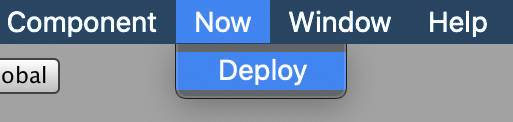

<div align="center">
</br>
<h1 align="center">Unity Now</h1>
<p align="center">
Deploy Unity WebGL builds on Zeit Now serverless platform with ease.
</p>
</div>

## Installation
#### Using UnityPackageManager (for Unity 2018.3 or later)
Find the manifest.json file in the Packages folder of your project and edit it to look like this:
```js
{
  "dependencies": {
    "com.skibitsky.UnityNow": "https://github.com/skibitsky/unity-now.git#1.0.1",
    ...
  },
}
```
To update the package, change `#{version}` to the target version.  
Or, use [UpmGitExtension](https://github.com/mob-sakai/UpmGitExtension).

#### Using legacy unitypackage
0. Download the latest .unitypackage from [Releases](https://github.com/skibitsky/unity-now/releases)
1. Import it into your Unity Project

## Setup
0. Add your [access token](https://zeit.co/account/tokens) to the **Configure Now** assets (Assets/unity-now/ConfigureNow)
1. Run Now→ Deploy from the menu bar
	<br>
3. Select your WebGL build
4. Wait till deployment completes

## Configuration
You can configure Unity Now using **Configure Now** scriptable object. It is located at *Assets/unity-now/ConfigureNow* and contains the following properties:

| Name | Description |
| --- | --- |
| **Token** | Zeit Now access token. You can generate a new one [here](https://zeit.co/account/tokens) |
| **Base URL** | Endpoint base URL. You can change it if you need a certain server location. [Read more](https://zeit.co/docs/api/#api-basics/server-specs/origins) |
| **Copy URL** | If enabled, Unity Now will save the deployment URL to the clipboard after the deployment is complete |

## License
MIT © [skibitsky](http://skibitsky.com)
